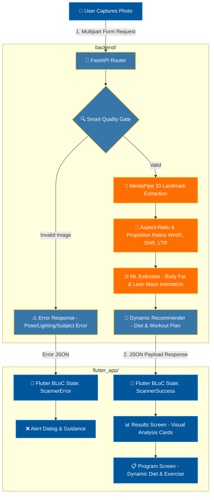

# AI Body Scanner 💪🤖

A full-stack, AI-powered health and body analysis assistant that brings mobile and computer vision technologies together. **AI Body Scanner** analyzes full-body photographs using advanced machine learning models to estimate body fat percentage, calculate lean body mass, analyze health risks, and dynamically generate **personalized diet and workout plans** based on the user's physical geometry.

---

> [!IMPORTANT]
> ### 🎓 TÜBİTAK 2209-A Support
> This project is officially supported by the **TÜBİTAK 2209-A University Students Research Projects Support Program** (Scientific and Technological Research Council of Turkey). 

---

## 🚀 Architecture & System Workflow

The application consists of two highly decoupled core modules:
1.  📱 **Frontend (`flutter_app/`)**: Developed with Flutter & Dart, utilizing the **BLoC** pattern for state management, featuring custom camera capture overlays and responsive visual layout widgets.
2.  ⚙️ **Backend & AI Engine (`backend/`)**: Developed with Python & FastAPI, utilizing OpenCV and Google MediaPipe for image stream processing, computer vision analysis, and recommendations logic.

### 🔄 End-to-End Data Flow

The sequence below illustrates the complete lifecycle from when the user captures a photograph in the Flutter app to when the backend processes, validates, calculates biological indices, and returns custom personalized fitness schedules:



---

## 🌟 Key Features

> [!NOTE]
> AI Body Scanner is far more than a basic image uploader; it is a highly accurate, shape-sensitive biometric evaluation and feedback suite.

*   **⚡ Advanced Pose Landmark Extraction (MediaPipe Tasks API)**: Leverages Google's state-of-the-art computer vision pipelines to locate 33 distinct 3D landmarks across the user's frame within milliseconds.
*   **📐 Proportional Biometric Indicators**: Analyzes structural geometry from raw pixel distances to compute advanced physiological proxies:
    *   **WHtR** (Waist-to-Height Ratio)
    *   **SHR** (Shoulder-to-Hip Ratio)
    *   **LTR** (Limb-to-Torso Ratio)
*   **⚖️ Robust Body Composition Estimator**: Combines baseline Deurenberg calculations with aspect-ratio-corrected visual estimators for precise, body-type-aware fat and lean mass outputs.
*   **🛡️ Smart Quality Gate**: Automatically verifies visual inputs, checking for human presence, absolute body-frame visibility, vertical alignment, and light thresholding to prevent hallucinated results.
*   **🎨 Premium Arayüz & Micro-interactions**: Features a highly polished, responsive user interface with curated color palettes, elegant cards, and smooth animations using the `animate_do` framework.

---

## 🛠️ Tech Stack

| Layer | Technology / Library | Purpose / Role |
| :--- | :--- | :--- |
| **Frontend Core** |   | Cross-platform mobile ecosystem and layouts |
| **State Management**| BLoC (`flutter_bloc`) | Highly testable, predictable unidirectional data flow |
| **UI & Animations** | `animate_do`, Custom Painters | Fluid transitions, clean indicators, and premium look |
| **Backend Core** |   | Fast, modern, and asynchronous AI backend server |
| **Computer Vision** | OpenCV, NumPy | Image pre-processing, matrix operations, pixel ratios |
| **Yapay Zeka (AI)** | MediaPipe (Tasks Vision API) | High-speed 33-point 3D skeleton pose mapping |

---

## ⚙️ Getting Started

Follow these steps to run the application locally on your machine.

### 1️⃣ Starting the AI Engine (Backend)

*Pre-requisite: Make sure Python 3.10+ is installed on your computer.*

```bash
# Navigate to the backend directory
cd backend

# Install project dependencies (FastAPI, OpenCV, MediaPipe, NumPy, etc.)
pip install -r requirements.txt

# Launch the local Uvicorn development server
uvicorn main:app --host 0.0.0.0 --port 3000
```

### 2️⃣ Launching the Mobile App (Frontend)

*Pre-requisite: Make sure the Flutter SDK is installed and configured.*

```bash
# Navigate to the flutter application directory
cd flutter_app

# Fetch required packages
flutter pub get

# Launch the app on a connected physical device or emulator/simulator
flutter run
```

> [!TIP]
> **Physical Device Testing:** If you wish to test the application on your physical iOS/Android device, ensure both your computer and your phone are on the exact same Wi-Fi network. Update the API target host in `api_service.dart` to your computer's local IP address (e.g., `192.168.1.X`) instead of using `localhost`.

---

## 🧪 Testing & Validation Suite

To ensure overall product stability, the project features a rigorous, high-speed test suite:

*   **Frontend Tests**: Verifies BLoC state cycles, layout rendering, and mapper methods.
*   **Backend Tests**: Tests endpoint handling, mock request streams, and math correctness in the AI estimators using `pytest`.

To check detailed execution flags and configurations, review the [TESTING.md](file:///Applications/Projects/ai-body-scanner/TESTING.md) guide.

### Run All Tests Simultaneously
```bash
(cd flutter_app && flutter test) && (cd backend && pytest tests/)
```

---

## 💡 Future Roadmap
- [ ] Incorporate a interactive **Historical Progress Screen** with charts to track changes over time.
- [ ] Add a camera **Real-Time Skeleton Overlay** to guide the user into the perfect pose before taking the shot.
- [ ] Extend recommendation mappings with broader nutrition database APIs.
